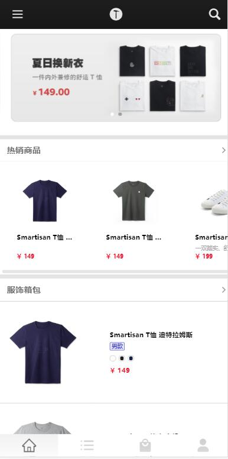
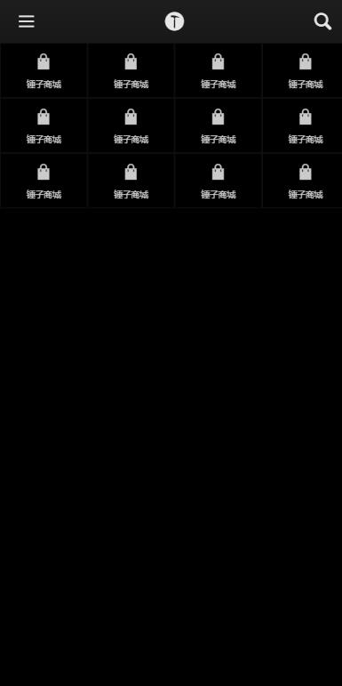
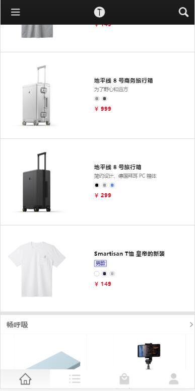
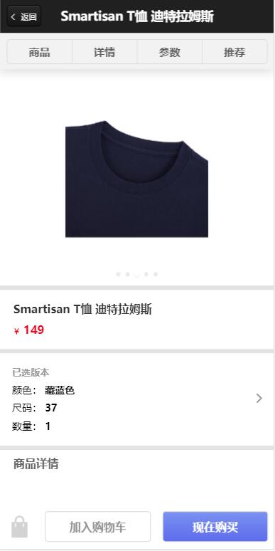
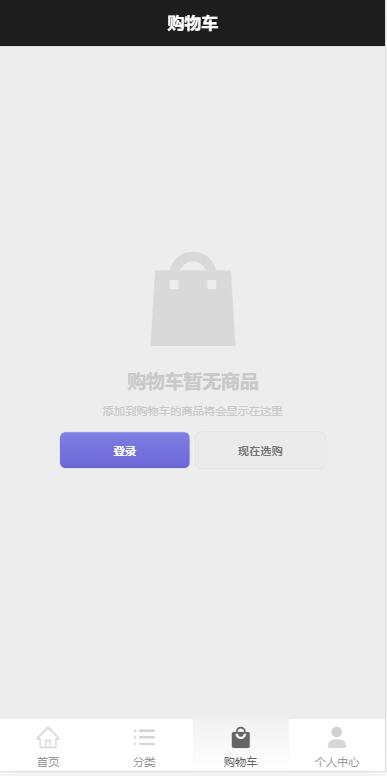
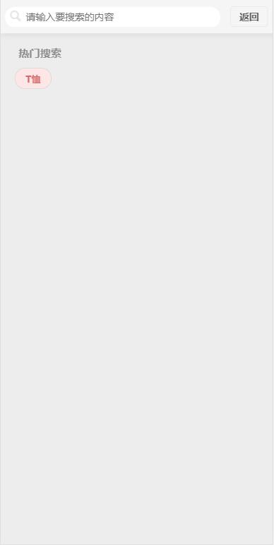

# smartisan

- 仿锤子官网移动端  

- 0-smartisnServer 简单后端服务器，获取锤子api数据  

- 通过swiper实现 banner卡片，热销商品  

- 通过自定义goodblock组件，实现商品信息块的复用  
  自定义price组件，实现价格样式的复用，

- 通过父子组件传值，实现数据流通，减少api请求  

- 通过路由传参，实现不同商品的数据获取  

- 效果展示  
  
  
  
    
  
  
    
  